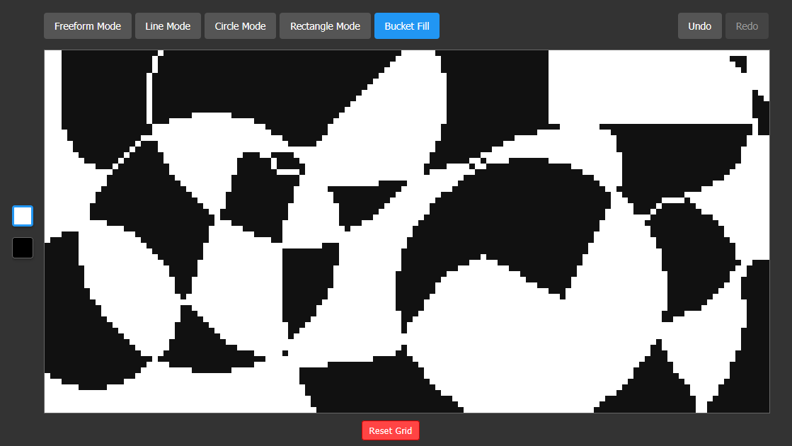

# Pixel Grid Editor

A React-based pixel art editor for OLED displays with ESP32 integration. This application allows you to create and edit pixel art with various drawing tools and send it directly to an ESP32-connected OLED display.



## Features

- **Various Drawing Tools**:
  - Freeform Mode: Draw with variable brush sizes
  - Line Mode: Create straight lines between two points
  - Rectangle Mode: Create rectangle outlines
  - Circle Mode: Create circle outlines
  - Bucket Fill: Fill enclosed areas

- **Editing Features**:
  - Undo/Redo functionality (Ctrl+Z / Ctrl+Y)
  - White and black color options (draw/erase)
  - Reset grid option
  - Adjustable brush size (for Freeform mode)

- **ESP32 Integration**:
  - Direct transmission to ESP32-connected OLED displays
  - Automatic updates (10 FPS)
  - Connection status monitoring

- **File Operations**:
  - Import BMP files (1-bit or 24-bit, 128x64 pixels)
  - Export designs as BMP files

## Installation

### Prerequisites
- Node.js (with npm or yarn)
- ESP32 with SH1106G OLED display (for hardware integration)

### Setup React Application
1. Clone this repository
2. Install dependencies:
```
npm install
```
3. Start the development server:
```
npm start
```
4. Access the application at `http://localhost:3000`

### ESP32 Setup
1. Open the `esp32_integ/pixel_display/pixel_display.ino` file in the Arduino IDE
2. Update the WiFi credentials:
```cpp
const char* ssid = "YOUR_WIFI_SSID";
const char* password = "YOUR_WIFI_PASSWORD";
```
3. Install required libraries via Arduino Library Manager:
   - Adafruit SH110X
   - Adafruit GFX
   - ArduinoJson
4. Upload the code to your ESP32
5. Note the IP address displayed on the OLED screen

## Usage

### Drawing Tools
- **Freeform Mode**: Click and drag to draw freely
- **Line Mode**: Click and drag to create a straight line
- **Circle Mode**: Click and drag to create a circle outline
- **Rectangle Mode**: Click and drag to create a rectangle outline
- **Bucket Fill**: Click an area to fill it with the selected color

### Keyboard Shortcuts
- **Space** (hold): Draw while hovering
- **B**: Switch to Brush (Freeform) mode
- **Ctrl+Z**: Undo
- **Ctrl+Shift+Z** or **Ctrl+Y**: Redo
- **Backspace**: Reset grid

### ESP32 Connection
1. Click the "ESP32 OLED" button
2. Enter the IP address of your ESP32
3. Click "Test Connection" to verify connectivity
4. Click "Send to OLED" to update the display
5. Enable "Auto-update" for real-time updates

### File Operations
- Click "Import BMP" to load a 128x64 pixel BMP file
- Click "Export BMP" to save your design as a BMP file

## Project Structure

```
/
├── public/               # Public assets
├── src/
│   ├── components/
│   │   ├── pixelGrid/    # Grid and drawing tools
│   │   ├── BMPHandler.jsx # BMP import/export
│   │   └── ESP32Connection.jsx # ESP32 integration
│   ├── App.jsx           # Main application component
│   ├── index.jsx         # Entry point
│   └── index.css         # Global styles
└── esp32_integ/          # ESP32 Arduino code
    └── pixel_display/    # OLED display controller
```

## Technical Details

- 128x64 pixel grid (matching common OLED displays)
- Canvas-based brush outline for precision drawing
- Bresenham's line algorithm for line drawing
- Midpoint circle algorithm for circle drawing
- Run-length encoding for efficient data transfer to ESP32

## License

MIT License - See LICENSE file for details.

## Contributing

Contributions are welcome! Please feel free to submit a Pull Request.
